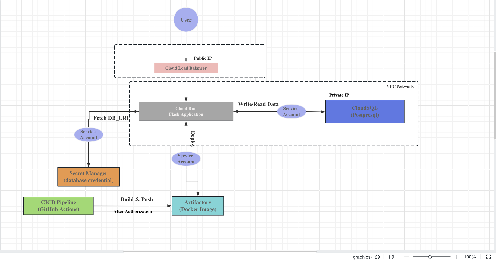

# klm-notes-api

Simple Flask-based Notes API with PostgreSQL, designed to run locally using Docker Compose.

Prerequisites
- `git` is installed
- `python` is installed
- `docker` and `docker-compose` is installed and running

Local Setup Instructions

1. Clone the repository

	 ```bash
	 git clone https://github.com/AhmedSoliman92/klm-notes-api.git
	 cd klm-notes-api
	 ```

2. Start the application with Docker Compose

	 ```bash
	 docker-compose up --build -d
	 ```

	 - The Compose file starts two services: `flask-app` and `postgresql`.
	 - The Flask app is exposed on host port `5100` (mapped to container port `5000`).

3. Check logs (optional)

	 ```bash
	 docker-compose logs -f flask-app
     docker-compose logs -f postgresql
	 ```

4. Stop and remove containers

	 ```bash
	 docker-compose down
	 ```

API Usage

The API base URL when running locally via Docker Compose is: `http://localhost:5100`

Endpoints

- `POST /notes` — Create a new note
	- Example:

		```bash
		curl -s -X POST http://localhost:5100/notes \
			-H "Content-Type: application/json" \
			-d '{"title": "First note", "content": "This is a note."}'
		```

- `GET /notes` — List all notes
	- Example:

		```bash
		curl -s http://localhost:5100/notes
		```

- `GET /notes/<id>` — Get a single note
	- Example:

		```bash
		curl -s http://localhost:5100/notes/1
		```

- `PUT /notes/<id>` — Update a note's `title` and/or `content`
	- Example:

		```bash
		curl -s -X PUT http://localhost:5100/notes/1 \
			-H "Content-Type: application/json" \
			-d '{"title": "Updated title", "content": "Updated content."}'
		```

- `DELETE /notes/<id>` — Delete a note
	- Example:

		```bash
		curl -s -X DELETE http://localhost:5100/notes/1
		```

Notes

- The Compose file maps the container's port `5000` to host `5100`; use `http://localhost:5100`.
- Environment variables are set in `docker-compose.yml` (development values). Adjust for production.
- If Postgres takes time to become healthy, `flask-app` depends on `postgresql`'s health check; it will try every 6 seconds for 5 times, if not check logs with `docker-compose logs -f postgresql`.

Running tests

There are pytest-based tests under the `tests/` directory. You can run them locally (outside Docker). Use the commands for your platform below.

macOS / Linux (bash or zsh)

```bash
python3 -m venv .venv
source .venv/bin/activate
pip install -r requirements.txt
python -m pytest -q
```

Windows (Command Prompt)

```cmd
python -m venv .venv
.\.venv\Scripts\activate
pip install -r requirements.txt
python -m pytest -q
```

Note

- If your system requires `python3` rather than `python`, replace `python` / `pip` accordingly (e.g., `python3`, `pip3`).

<br>
<br>

# Continuous Integration / Continuous Deployment (CI/CD)
```

Workflow name: "CI/CD Pipeline"
Task: automatically lint, test, and build the Docker image for klm-note-api.

The pipeline is triggered automatically under the following conditions:
* On every push to the main branch.
* On every pull_request targeting the main branch.
```

### Configuration: Setting Up GitHub Secrets

```
To add these secrets:

1. Navigate to Settings: In GitHub repository, click the "Settings" tab.
2. Go to Secrets: In the left sidebar, navigate to "Security" -> "Secrets and variables" -> "Actions".
3. Add New Repository Secret: Click the "New repository secret" button and enter the following names and corresponding values:

Secret Name: DOCKER_USERNAME
Purpose: Your Docker Hub username.

Secret Name: DOCKER_PAT
Purpose: Your Docker Hub Personal Access Token (PAT) used for logging in and pushing images.

Secret Name: DB_PASSWORD
Purpose: The password used to reset the PostgreSQL user's password during the tests job.

Secret Name: DB_URL
Purpose: The full connection string used to connect to the test PostgreSQL database.
```
### You can manually trigger the full pipeline.
```

1. Navigate to Actions: Go to the "Actions" tab in GitHub repository.
2. Select the Workflow: In the left sidebar, click on the "CI/CD Pipeline" workflow.
3. Run Workflow: On the main workflow page, click the "Run workflow" dropdown button located on the right side.
4. Click the green "Run workflow" button.

```

### Workflow Stages
```

The pipeline is broken down into sequential jobs to ensure code quality and stability before building:

Job: lint
Dependency: None
Purpose: Checks code against established standards.


Job Name: tests
Dependency: lint
Purpose: Executes unit/integration tests after setting up the PostgreSQL database instance.


Job Name: build
Dependency: lint, tests
Purpose: Builds a multi-platform Docker image, tags it with version metadata, and pushes it to Docker Hub.
```

### Github Actions for CICD

```
Since I am using github repository, then I will get many benifet from using github action, as following:
1. Native Integration: Seamless with github repo.
2. Cost: free for public repo.
3. Ecosystem: Rich marketplace of pre-built actions.
4. Security: Built-in secrets management.

```
# Cloud Infra Design


### Cloud Infrastructure Design



```
I chose Cloud Run over GKE or Compute engine for many reason:
Serviceless
Perfect for API Workloads
Cost Efficient
GKE will be more complex and higher cost for this simple API. While Compute engine need manual scaling and that's the strength of Cloud RUn.
```
### Identity and Access Management (IAM)

```
IAM Roles will be granted to Service Acount to be able to interact with other GCP services:
1. Grant Accessor Role to authorize Flask app to read secrets which is stored in Secret Manager.
2. Cloud SQL Client Role to to authorize Service Account to connect to the managed Postgresql database instance.


Also other authorization is needed for github actions:
1. Artifact Registry Writer to authorize cicd pipeline to push Docker image to the registry.
2. Cloud Run Developer to authorize the cicd pipeline to deploy the new image version to this Cloud Run.


```
### Secret management

```
Google Secret Manager will be used as the centralized, highly-available secret storage for sensitive application configuration such as DB_URL. This ensures credentials are never committed to code, stored in environment variables, or baked into the Docker image.
```
### Network

```
1. Cloud Load Balancer: Provides a global, stable, single IP address, handles HTTPS termination (SSL certificate management), and routes traffic to the Cloud Run service.
It will be the public entry point.

2. VPC Network: Cloud Run is a serverless product, the best practice for connecting it to a private database is via Serverless VPC Access. It links the Cloud Run env to  VPC, allowing it to communicate with Cloud SQL using its private IP address, rather than relying on a public IP for the database.

```
### WAF

```
One more Security layer can be added which is Cloud Armor
for example we can set request limit per minute to 100 requests. If it's exceed, Too many request will be returned and IP will be blocked (let's say for 10 minutes).
```
# Consideration

This repository's instructions and config  are strictly for local development and testing. In case of cloud deployment, some of points must be considered:

* `DB_URL` must be adapted to a secure connection string pointing to the Cloud SQL instance. It  must fetch securely from GCP Secret Manager, with access governed by IAM policies.
* `Docker images` must be pushed to a private GCP Artifact Registry or other regional registry.
Terraform and GCP Artifactory.
* The entire GCP environment (VPC, Cloud Run service, Cloud SQL instance, IAM policies, etc.) is provisioned using `Terraform`. best practices to be located  in terraform/ dir.
